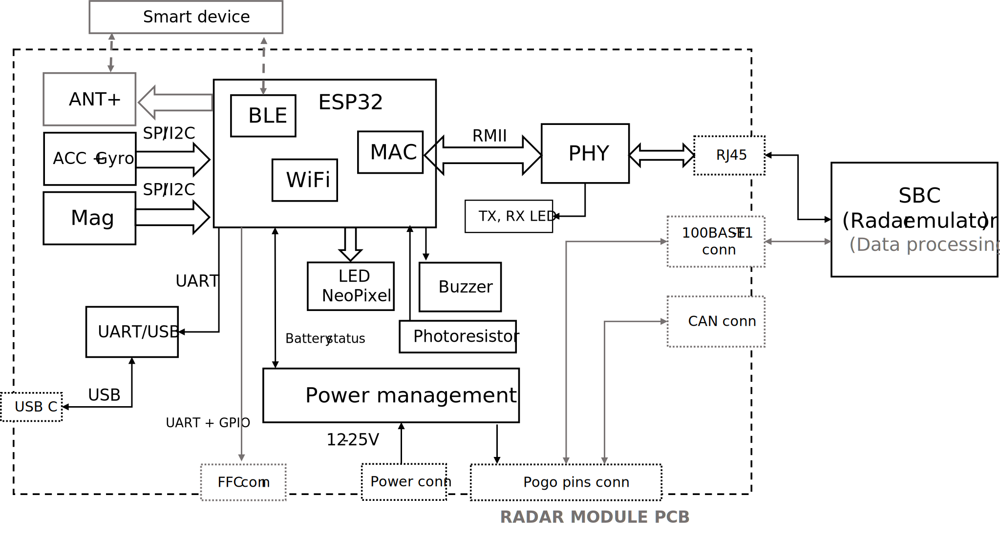

# Development Module for Safety Radar Sensor in Single-Track Vehicles

### Features on PCB
* ESP32
    * BLE
    * MAC
    * 2 UARTs (flashing/debugging + radar interface)
    * $I^2C$ or SPI
* CP2102 USB-UART module
* PHY Ethernet module with connector
* IMU (6+3 DoF)
* Power management
* LED neopixel
* Buzzer
* Pogo pins – board to board connector
* ESP32 GPIO <-> radar pins (FFC conn)
* 100BASE-T1 connector
* ANT+ module

### Thesis (read-only)
https://www.overleaf.com/read/hrqsdpdkjjvk

### Block diagram

### Power management

#### Components

* Power multiplexor - TPS2121   
    https://www.ti.com/lit/ds/symlink/tps2121.pdf?ts=1699904287563&ref_url=https%253A%252F%252Fwww.ti.com%252Fproduct%252FTPS2121

* <del> Power monitor - MICROCHIP Dual channel PAC1952-1 VQFN16 – **Farnell**
    https://ww1.microchip.com/downloads/aemDocuments/documents/MSLD/ProductDocuments/DataSheets/PAC195X-Family-Data-Sheet-DS20006539.pdf

* Power monitor - TI INA3221 Triple-Channel, Shunt and Bus Voltage Monitor VQFN16
    https://www.ti.com/lit/ds/symlink/ina3221.pdf?HQS=dis-mous-null-mousermode-dsf-pf-null-wwe&ts=1700495007519&ref_url=https%253A%252F%252Fwww.mouser.fr%252F

* DC/DC 5V -> 3.3V - TI TPS62140  
    https://datasheet.lcsc.com/lcsc/2304140030_Texas-Instruments-TPS62140RGTR_C138725.pdf

* DC/DC 20V -> 12V RICHTEK RT8259   
    https://www.farnell.com/datasheets/1720510.pdf

* DC/DC 20V -> 5V DIODES AP63205WU  
    https://www.diodes.com/assets/Datasheets/AP63200-AP63201-AP63203-AP63205.pdf