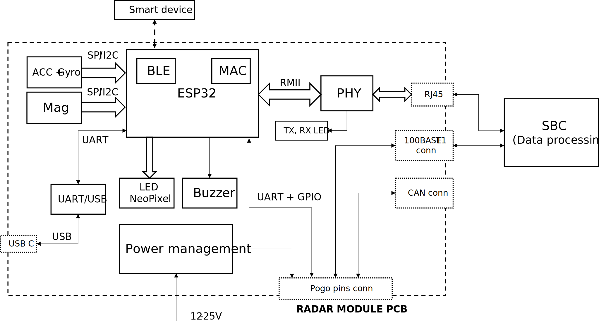

# Development Module for Radar Safety Sensor in Single-Track Vehicles

### Features on PCB
* ESP32
    * <r> BLE
    * MAC
    * 2 UARTs (flashing/debugging + radar interface)
    * $I^2C$ or SPI
* CP2102 USB-UART module
* PHY Ethernet module with connector
* IMU (9 DoF)
* Power management
* LED neopixel
* Buzzer
* Pogo pins – board to board connector
* ESP32 GPIO <-> radar pins <o> (connector?)
* 100BASE-T1 connector
* <r> ANT+ module 

### Questions
* Parameters of IMU
* Name of the project
    * Radar Safety Sensor
    * Ride Safety Radar Sensor
* Electrical characteristics of the radar module

### Thesis (read-only)
https://www.overleaf.com/read/hrqsdpdkjjvk

### Block diagram

