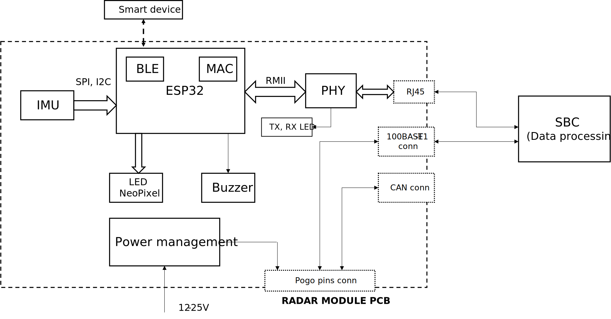

# Development Module for Radar Safety Sensor in Single-Track Vehicles

### Modules on PCB
* ESP32
    * BLE
    * MAC
* CP2102 USB-UART module
* PHY Ethernet module with connector
* IMU
* Power management
* LED neopixel
* Buzzer
* Pogo pins – board to board connector
* 100BASE-T1 connector
* ANT+ (need be?)

### Thesis (read-only)
https://www.overleaf.com/read/qdtmcycwxqrg

### Block diagram

